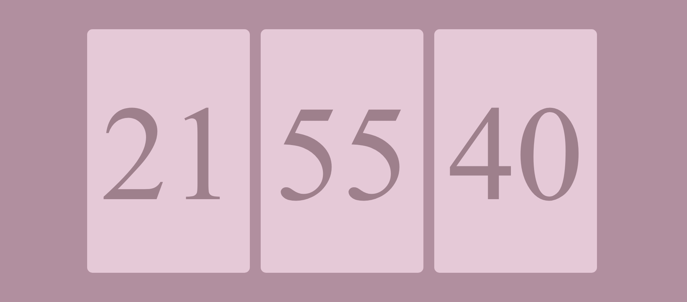

# Flip Clock Rosa e Vintage 💗🕰️



Este projeto é um **flip clock** estilo vintage com uma estética **rosa**, inspirado nos relógios de abas mecânicas clássicos. Ele exibe a hora em um formato visualmente agradável, com um toque retrô e uma vibe nostálgica, perfeito para quem aprecia designs clássicos e minimalistas.

## 📌๋࣭ ⭑📜. Funcionalidades

- Exibição das horas, minutos e segundos
- Animação suave na troca dos números
- Estética vintage com uma paleta de cores rosa suave
- Interface responsiva e compatível com diferentes dispositivos

## 🩰 Tecnologias Utilizadas

- **HTML5**: estrutura básica do relógio
- **CSS3**: design visual com ênfase na estética vintage e animações
- **JavaScript**: lógica do relógio para atualizar o tempo em tempo real

## 𓍢ִ໋🌸🎻🪞 Estilo Vintage

O design foi inspirado nos famosos relógios de abas dos anos 60 e 70, com uma tipografia clássica e um esquema de cores rosa pastel para dar um toque moderno e leve. O foco foi criar um visual autêntico e, ao mesmo tempo, estiloso.

## 🔧 Como Executar

1. Faça o clone deste repositório:
    ```
    git clone https://github.com/meduardajustino/Flip-Clock-Vintage.git
    ```
2. Abra o arquivo `index.html` no navegador.

## 🧸𓍢ִ໋🌷͙֒🍪 Contribuição

Sinta-se à vontade para contribuir com melhorias ou novas funcionalidades! Basta abrir um pull request ou criar uma issue para discussão.
